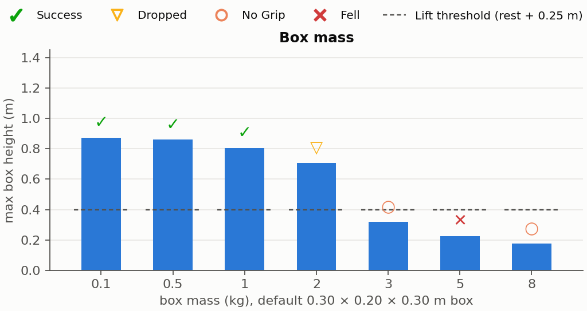
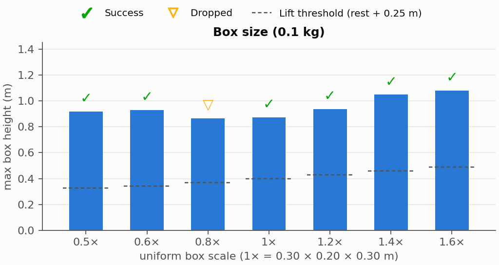
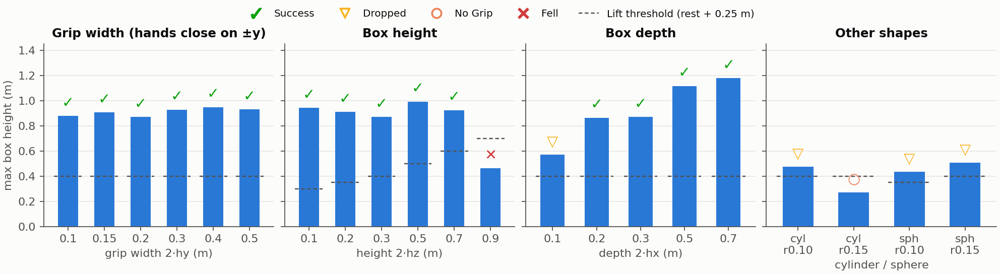
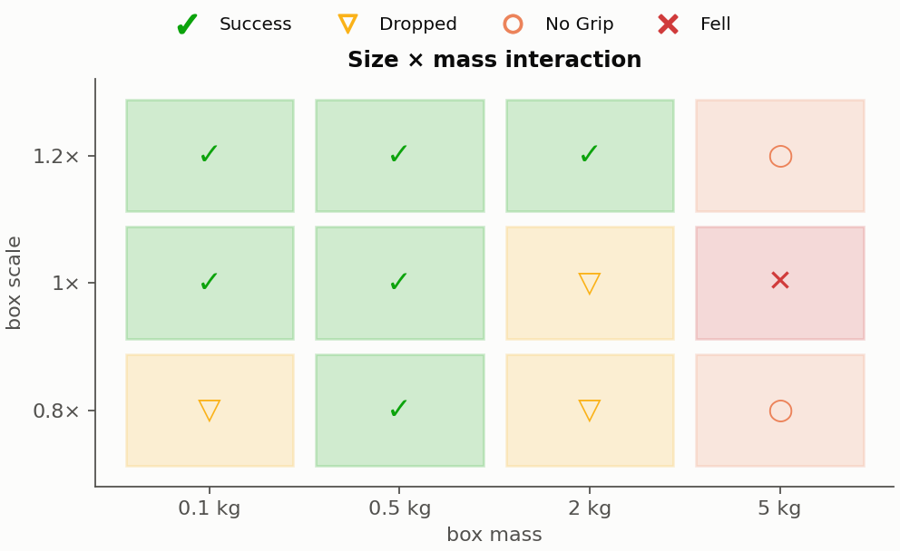

# Box stress test — SceneBot pickup (their motion, friction grip)

What kinds of boxes can the SceneBot policy pick up, carry, and set down
when driven by **its own pickup motion**? 44 runs (37 unique configs) of
`run_pickup.py`'s move → pick → carry → drop script on the flat floor
scene, varying only the physical box: size, shape, and mass. Everything
else is held fixed — same reference motion, same walk, same grab spot
(the box always spawns exactly where the pickup clip's hands close), one
deterministic attempt per config, friction-only grip (no weld, no squeeze
bias). Videos for every run are alongside this report
(`out/stress/<name>.mp4`); raw metrics in `results.json`.

**Outcome codes** — ✓ Success (picked, carried, placed on the floor,
walked away, never fell) · ▽ Dropped (lifted > 0.25 m, then lost mid-
carry) · ○ No grip (never lifted; the robot pantomimes the motion) ·
✕ Fell (robot toppled).

## Headline: the operating envelope

The pickup is **remarkably tolerant of box geometry and brutally
intolerant of mass and curvature**:

- **Size**: boxes from **0.5× to 1.6×** the trained box (0.15 m to 0.48 m
  on a side) all carry at 0.1 kg. The one blemish (0.8×) is boundary
  noise, not a hole — the same 0.8× box succeeds at 0.5 kg.
- **Mass**: clean carries up to **1 kg**; **2 kg** lifts to 0.71 m and
  then slips out; **3 kg+** never breaks the lift threshold. The policy
  itself never falls from a heavy box it cannot budge (8 kg: robot calmly
  fails, tracking error 0.68 m) — the dangerous zone is **5 kg**, heavy
  enough to half-lift, then it torques the robot over mid-squat.
- **Shape**: any reasonably proportioned **flat-faced box** works; **no
  curved shape does** — all four cylinder/sphere variants slip out or
  never grip.

## Mass: a sharp cliff at 2 kg



0.1 → 1 kg carry cleanly (carry height easing 0.87 → 0.80 m as the load
grows). 2 kg is the transition: a real lift to 0.71 m, then the box
squeezes out during the carry walk. 3 kg gets 0.32 m off the floor at the
squat peak but cannot be held through the stand-up. 5 kg is the only
fall in the sweep. 20× the training mass (the demo box is 0.1 kg) is
simply outside what a friction grip from this motion can hold.

## Size: broad tolerance, boundary noise at the edges



Half to 1.6× the trained size all work, with carry height growing with the
box (a 1.6× box rides at 1.08 m because its center sits farther from the
chest). The lone ▽ at 0.8× is a knife-edge grip that the same box survives
at 0.5 kg (see the matrix below) — single deterministic runs near a
boundary flip with tiny perturbations, the same sensitivity documented
for the grasp variants elsewhere in this repo.

## Shape: flat faces are the requirement



- **Grip width** (the ±y faces the palms close on): 0.10 m through
  **0.50 m** all succeed — wider than the hands' natural 0.41–0.46 m
  span, because the reference drives the palms *into* the faces and the
  policy supplies the press.
- **Height**: up to **0.70 m** tall carries (the hands grab ~0.19 m up,
  so a 0.7 m box is held near its base like a tall parcel). At **0.90 m**
  the box towers over the grip; the lift torque tips box and robot over —
  the only geometry-caused fall.
- **Depth**: 0.20–**0.70 m** succeed (the 0.7 m-deep box hugs like an
  oversized parcel, carried at 1.18 m). A **0.10 m-thin** slab lifts but
  slips out mid-carry — too little face for a stable press.
- **Cylinders and spheres**: every one fails (▽/○). The flat palms make
  line/point contact on curved surfaces; the grip that holds a 0.5 m-wide
  box cannot hold a 0.15 m cylinder.

## Size × mass interaction: bigger boxes carry more



At 2 kg, only the **1.2× box** completes the carry — a larger box meets
the palms with more face area and sits deeper in the arm wrap, so grip
capacity *grows* with box size. 5 kg fails at every size (and at 1× it is
the fall case). The 0.8×/0.1 kg cell is the same boundary-noise drop as
the scale sweep; at 0.5 kg it is solid.

## Secondary observations

- **Tracking is unaffected by the box until the grip fails**: max
  root-tracking error is 0.32 m (the known walk transient) in every
  successful run regardless of box; it only blows up when the robot falls
  (2.9 m at 5 kg, 1.6 m for the 0.9 m tower).
- **Failures are usually graceful.** Of the 14 unique failures, 12 end
  with the robot upright and walking away from a pantomimed carry; only
  2 configurations fell (5 kg at 1× scale, and the 0.9 m-tall box).
- The commander's script (walk 3 s, hold 1 s, carry-walk 2.5 s) and the
  spawn geometry are identical across runs, so differences are purely the
  box's physics.

## Caveats

One deterministic attempt per config — no retry logic (this is the plain
`run_pickup.py` script, not the grip closed loop of `run_mm_pickup.py`),
no seed variation, so outcomes within ~0.05 m/0.5 kg of a boundary should
be read as "marginal", not binary. The box always spawns at the exact
clip grab spot with the trained yaw; badly placed or rotated boxes are a
separate axis not tested here. No terrain (flat floor only), per scope.

## Reproduce

```bash
~/miniconda3/envs/mm-g1-sonic/bin/python stress_test.py          # all 44 runs + videos
~/miniconda3/envs/mm-g1-sonic/bin/python stress_plots.py         # figures + table
# single config:
~/miniconda3/envs/mm-g1-sonic/bin/python run_pickup.py \
    --box-type box --box-size 0.15 0.10 0.35 --box-mass 2.0
```

## All runs

(see `results_table.md` for the full table, `results.json` for raw
metrics, and `<name>.mp4` for each run's video)
