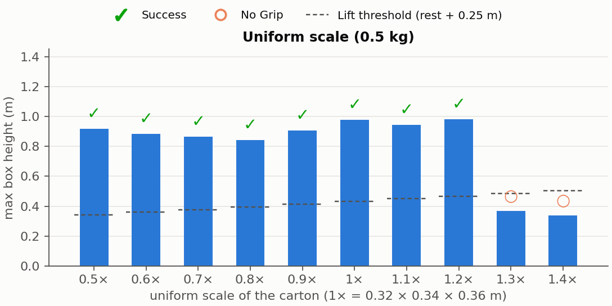
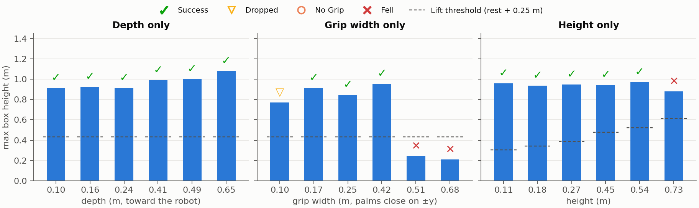

# Carton shape sweep — medicine box baseline, 0.5 kg fixed

Round 2 of the box stress test, per request: **mass fixed at 0.5 kg, box
shapes only** (no cylinders/spheres), baseline = the MEDICINE carton's
true oriented dimensions (0.324 × 0.339 × 0.363 m, from
`tools/make_medicine_box.py`). Two families through `run_pickup.py`'s
move → pick → carry → drop script (SceneBot's own motion, friction grip,
one deterministic attempt): uniform scaling 0.5×–1.4×, and one axis at a
time scaled 0.3×–2.0× with the other two at baseline.

Every run keeps three artifacts in this directory:
- `<name>.mp4` — video with the **box dimensions captioned on every
  frame** and a **SUCCESS/FAIL end card** (verdict + reason + dims),
- `<name>.xml` — the compiled scene MJCF, so the box geometry of record
  is in the file (`free_box_geom` size/mass),
- a row in `results.json`.

## Result: 22/28 carry; grip width is the axis that bites





| axis | carries | fails | failure mode |
|---|---|---|---|
| uniform | **0.5× – 1.2×** (0.16–0.44 m cartons) | 1.3×+ | never lifts (no grip) |
| depth (x) | **0.10 – 0.65 m** — all tested | — | none; the 0.65 m parcel carries highest (1.08 m) |
| grip width (y) | **0.17 – 0.42 m** | 0.10 m · 0.51 m · 0.68 m | thin slips out mid-carry; wide **topples the robot** |
| height (z) | **0.11 – 0.54 m** | 0.73 m | lifts to 0.88 m, then the tower brings the robot down |

## Reading the boundaries

- **Grip width is the sensitive dimension, in both directions.** Too thin
  (0.10 m) and the palms close past their target with little face to
  press — the carton squeezes out mid-carry. Too wide (≥ 0.51 m) is
  worse than a failed grip: the reference still rams the palms into the
  oversized faces, the forced-wide arms wreck the posture, and the robot
  falls. Notably, a 0.50 m width *succeeded* in round 1 at 0.1 kg — at
  0.5 kg the same geometry is a fall. Width tolerance shrinks with load.
- **Depth is a non-factor.** 0.10 to 0.65 m all carry, and deeper
  cartons ride higher because their center sits farther forward.
- **Height is forgiving up to 1.5× (0.54 m).** The grab happens ~0.19 m
  up, so tall cartons are held near the base; at 0.73 m the box's
  inertia above the grip wins during the stand-up — it reaches 0.88 m
  and then takes the robot down.
- **The uniform ceiling is 1.2× at 0.5 kg** (0.39 × 0.41 × 0.44 m). At
  1.3× the grip never establishes at all — a cleaner failure than the
  wide-width falls, because all dimensions grow together and the palms
  simply never generate enough press before the lift. Round 1 carried
  larger boxes at 0.1 kg: size and mass trade off against each other.
- **Failures at 0.5 kg are harsher than at 0.1 kg**: half of the six
  failures here are falls (round 1: 2 of 14). More load means more
  stored energy when a grip goes wrong.

The medicine carton itself (1×) is comfortably inside the envelope:
carried to 0.98 m, placed, no fall — with margin in every direction
except upward in size.

## Reproduce

```bash
~/miniconda3/envs/mm-g1-sonic/bin/python stress_shape.py         # 28 runs + videos + MJCFs
~/miniconda3/envs/mm-g1-sonic/bin/python stress_shape_plots.py   # figures
# single config:
~/miniconda3/envs/mm-g1-sonic/bin/python run_pickup.py \
    --box-size 0.162 0.2543 0.1815 --box-mass 0.5 \
    --save-mjcf my.xml --video my.mp4
```

Caveats as in round 1: one deterministic attempt per config (no retry
loop), boundary outcomes are marginal rather than binary, box always
spawns at the clip's grab spot, flat floor only.
